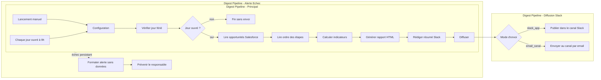

# Architecture

Trois workflows n8n. Le principal prépare le rapport sans rien savoir de Slack : il passe le message et le fichier HTML à un sous-workflow de diffusion. Changer de mode d'envoi ne touche que ce sous-workflow.

## Les nœuds clés

| Nœud | Rôle |
|---|---|
| **Configuration** | Seul endroit à modifier : seuils (180 j), devise, mode d'envoi, canal Slack, date forcée pour les tests |
| **Vérifier jour férié** | Calcule Pâques (algorithme de Meeus), puis lundi de Pâques, Ascension et Pentecôte. Aucune année codée en dur |
| **Lire opportunités Salesforce** | Une requête SOQL sur le périmètre, sans seuil : `IsClosed = false AND CloseDate = THIS_FISCAL_QUARTER` |
| **Calculer indicateurs** | Totaux, ventilation par étape, alertes « en retard » et « sans activité » |
| **Générer rapport HTML** | HTML autonome, styles inline, aucune ressource externe |
| **Diffuser** | Appelle le sous-workflow avec le texte et le fichier |
| **Alerte échec** | Email au responsable seul, sans montant ni nom de client |

## Choix de conception

- **Seuils hors de la requête.** Le code applique les 180 jours, la requête SOQL ne lit que le périmètre. Un seul appel API, et les seuils restent dans la configuration.
- **Diffusion isolée.** L'accès Slack n'était pas acquis au démarrage. Le passage de l'app Slack à l'email vers le canal se fait par un paramètre.
- **Alerte par email interne.** Si Slack tombe, une alerte envoyée par Slack tomberait avec lui.
- **Confidentialité.** Seuls Salesforce, n8n et Slack voient les montants et noms de clients. Aucune IA, aucun service de PDF ou d'hébergement.

## Règles de calcul

- **En retard** : clôture prévue dépassée, ou même étape depuis plus de 180 jours. Si `LastStageChangeDate` est vide, le calcul part de `CreatedDate`.
- **Sans activité** : dernière activité il y a plus de 180 jours. Sans aucune activité, le décompte part de la création.
- **Montant vide** : compté 0, signalé en bas du rapport.
